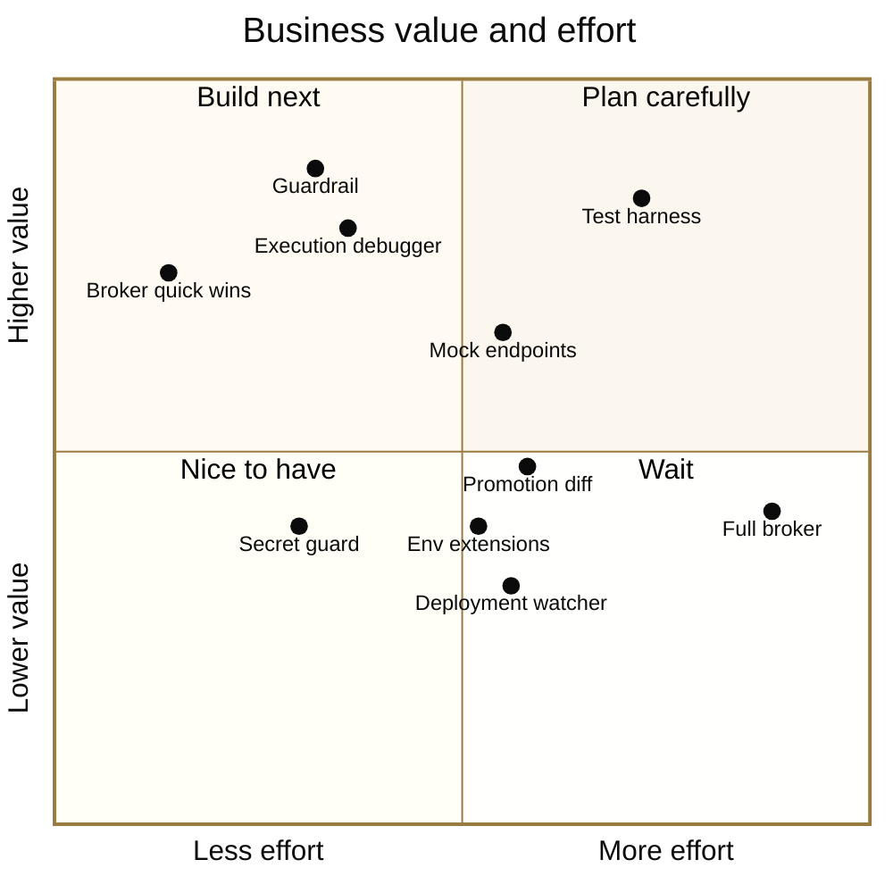

# Mod Ideas

Ideas for mods we could build next, starting with Boomi and integration work. Nothing on this page is built yet. Treat it as a brainstorm: add ideas, argue with the rankings, and claim one to build.

The [boomi-runtime](boomi-runtime/README.md) mod shows what a mod can do. It provisions a temporary Boomi runtime in the session, smoke-tests it, hands it to Boomi Companion through a shared `.env` and tears everything down at the end, while keeping the Platform API token out of the conversation. Mods can add:

- slash commands
- tools Claude can call
- network, process and file access
- session state
- lifecycle hooks, including hooks before and after every tool call
- status lines and panes

## What makes a good mod idea

A mod is worth building over a skill or a script when it uses something only a mod has:

- **Work that outlasts Claude's reply.** Polling, installs and watchers keep running in the background while you keep chatting.
- **A hook on every tool call.** A mod can check, refuse or redact what Claude does before or after it happens. `boomi-runtime` uses this to guard the API token.
- **The session's own runtime.** The Boomi runtime runs in the session's container, so a mod can put files in local folders the runtime reads, read its execution logs on disk, and start local services for it to call.
- **Commands that cost no tokens.** Slash commands run the same way every time without Claude interpreting them.

One limit to design around: **the Claude Code web app doesn't show status lines or panes yet.** An idea that depends on a pane should also work through a slash command.

## Value and effort

| Rank | Idea | Business value | Effort | Status |
|---|---|---|---|---|
| 1 | [Companion guardrail](#companion-guardrail) | High | Small to medium | **Next up** |
| 2 | [Execution debugger](#execution-debugger) | High | Small to medium | Idea |
| 3 | [Credential broker: quick wins](#credential-broker) | High | Small | Idea |
| 4 | [Process test harness](#process-test-harness) | High | Medium to large | Idea |
| 5 | [Mock endpoints](#mock-endpoints) | Medium to high | Medium | Idea |
| 6 | [General secret guard](#general-secret-guard) | Medium | Small to medium | Idea |
| 7 | [Promotion diff](#promotion-diff) | Medium | Medium | Idea |
| 8 | [Environment extensions manager](#environment-extensions-manager) | Medium | Medium | Idea |
| 9 | [Deployment watcher](#deployment-watcher) | Medium | Medium | Idea |
| 10 | [Credential broker: full](#credential-broker) | Medium | Large | Idea |

## The ideas

### Companion guardrail

**Check components against the team's standards before Boomi Companion deploys them.**

- **Problem:** A team can't adopt AI-built Boomi work if nobody can enforce its conventions. Reviewers end up checking names, folders and connection settings by hand.
- **Idea:** A `boomi-standards` mod with a before-tool-call hook that recognizes Companion's deploy scripts. It checks the components about to be deployed against rules in a checked-in `standards.json`:
  - naming patterns for processes, connections and profiles
  - required folders
  - no hard-coded passwords, tokens or hostnames in connection settings
  - required error handling, such as a Try/Catch on every process
- **Outcome:** A blocked deploy comes back to Claude as a refused tool call with the reasons, so Claude fixes the components and tries again. A `/standards check` command runs the same checks on demand.
- **Why a mod:** It reuses the before-tool-call hook that already guards the token in `boomi-runtime`. It needs no pane, so it works on the web.
- **Open question:** Does Companion keep component XML in the workspace before its scripts push it? If so, the checks read those files. If not, the mod has to fetch the components through the Platform API before deploy, which adds effort.

### Execution debugger

**Show Claude which step of a process failed, and what data it had at that point.**

- **Problem:** When a test execution fails, Claude often sees little more than `ERROR` and has to guess.
- **Idea:** A `/boomi trace <execution>` command and a `trace` tool Claude can call. They pull the execution's process log and each step's documents from the local runtime, then summarize where the documents stopped and why.
- **Why a mod:** The runtime runs in the session's container, so the execution artifacts are on local disk. This extends the existing `logs` tool.
- **Open question:** Which execution artifacts the runtime keeps on disk by default, and for how long.

### Credential broker

**Let mods and skills call the Platform API without the token ever being visible in the session.**

- **Quick wins:** Finish the token to-do items in the [boomi-runtime README](boomi-runtime/README.md#to-do):
  - Declare the token as a `sensitive` setting in `plugin.json`, which Claude Code keeps in secure storage.
  - Use the cloud environment's protected credentials where available.
  - Document a dedicated API user with only the permissions the mod needs, and how to rotate its token.
- **Full broker:** The mod holds the token and offers a `boomi_api` tool that makes allow-listed Platform API calls for other mods and skills, so none of them needs the token.
- **Limit:** Companion's scripts read the token from `.env`, and the broker can't change that. It protects everything except Companion's own calls, which is why the full version ranks lower than the quick wins.

### Process test harness

**Run sample documents through a deployed process and compare the outputs with expected results.**

- **Problem:** Integrations rarely have regression tests, so a mapping change can quietly break a field nobody checked.
- **Idea:** A `tests/` folder of input documents and expected outputs per process. `/boomi test <process>` deploys a test wrapper, runs every case and reports differences field by field. Claude can call the same command after each change.
- **Why a mod:** The Platform API's execute call takes process properties, not documents. The local runtime gets around that: a Disk connector in the wrapper reads inputs from a harness folder and writes outputs to another, so the mod controls both ends with no extra infrastructure.
- **Open questions:**
  - Overlap with Companion's own testing.
  - The Platform API can't delete components, so the wrapper must be created once and reused.

### Mock endpoints

**Test processes that call external systems without touching those systems.**

- **Problem:** Testing a process that posts to Salesforce, NetSuite or a partner API needs access, credentials and test data in that system.
- **Idea:** The mod starts a local mock HTTP server for the session. It records real responses once, or serves hand-written ones, and replays them. `/mock record`, `/mock replay` and `/mock show` manage it, and the requests a process sent can be checked in tests.
- **Why a mod:** It starts a background process for the session and stops it when the session ends. The runtime is in the same container, so it can reach the mock on `localhost`.

### General secret guard

**Apply the token guard to every credential, not only Boomi's.**

- **Idea:** Move the guard and redaction out of `boomi-runtime` into a reusable mod configured with a list of variable names and file patterns. It then covers Salesforce, AWS and partner keys too.
- **Why now:** It matters more once mock endpoints and test harnesses bring more systems into a session.

### Promotion diff

**Show what would change before a release moves from TEST to PROD.**

- **Idea:** Compare the packaged component versions deployed to two environments and write release notes from the differences. Optionally, refuse to promote anything this session hasn't smoke-tested or run through the test harness.
- **Care needed:** It touches production. Start read-only, so it reports and never deploys.

### Environment extensions manager

**View and set connection settings and process properties per environment, with secrets masked.**

- **Idea:** `/boomi ext show <environment>` and `/boomi ext set` use the same masking as `/boomi env`, so Claude can configure an environment without seeing its passwords.
- **Open question:** How much Companion already covers.

### Deployment watcher

**Show recent executions and errors for an environment, polled in the background.**

- **Idea:** A status line such as `✓ 42 runs · ⚠ 2 errors` and a pane listing recent executions, polled through the Platform API. It raises a toast when a new error appears.
- **Why it ranks low for now:** The web app doesn't show status lines or panes yet, so on the web it reduces to a status command. It moves up when panes reach the web.

## Add an idea or claim one

- **Add an idea:** Open a pull request that adds a section under [The ideas](#the-ideas) and a row in the table. Give it a **problem**, the **idea**, **why a mod** (what it needs that a skill or script can't do) and any **open questions**. Rough is fine.
- **Disagree with a ranking:** Change it in the same kind of pull request and say why in the description.
- **Claim an idea:** Set its status to **In progress** with your GitHub handle. Build it as a mod following the [project conventions](CLAUDE.md), and when it ships, move it from this page to the **Mods** table in the [README](README.md).
