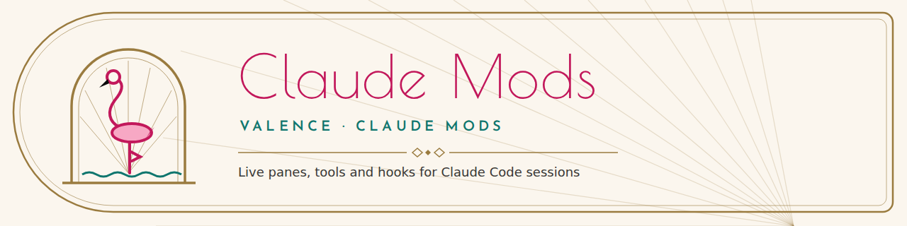

<picture>
  <source media="(prefers-color-scheme: dark)" srcset="brand/assets/banner-night.png">
  
</picture>

# Claude Mods

Mods for [Claude Code](https://claude.com/claude-code): plugins of function hooks that add live panes, status lines, slash commands, tools Claude can call, and session hooks. Each folder in this repository is one self-contained mod.

## Mods

None yet.

## Loading a mod

A mod is a folder with `.claude-plugin/plugin.json`, `hooks/hooks.json` and its hooks module.

- **Terminal:** `claude --plugin-dir <path to the mod>`
- **Claude Code on the web, the desktop app or an SDK host:** set `CLAUDE_CODE_PLUGIN_DIRS` to the mod's absolute path; separate several with `:`. In a cloud environment, add it under the environment's variables, for example `CLAUDE_CODE_PLUGIN_DIRS=/home/user/ClaudeMods/<mod>`.

A mod's settings show up under `/config`. Each mod's README lists its settings and anything it needs, such as network access or credentials.

## Developing

```bash
cd <mod>
claude plugin validate .
claude plugin test .
```

Mods use the API that ships with Claude Code. It's early access and may change between releases, so each mod's README notes the version it was built against.
