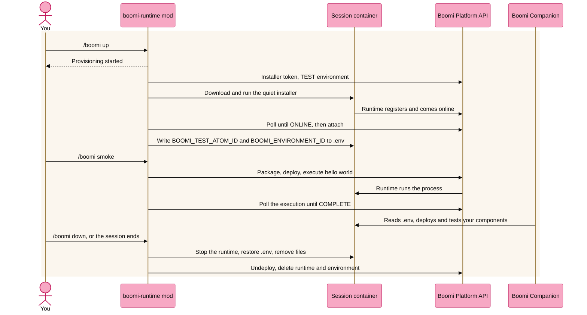

<picture>
  <source media="(prefers-color-scheme: dark)" srcset="assets/banner-night.png">
  
</picture>

# Boomi Runtime Mod

A Claude Code mod that gives a session its own temporary Boomi runtime. It works alongside [Boomi Companion](https://github.com/OfficialBoomi/bc-integration): the mod provisions the runtime and points Companion at it, Companion builds and tests your components on it, and the mod deletes it when you're done. You don't need admin rights or a Windows/Linux service.

> **Prototype.** Linux only, built for Claude Code on the web. Verified end to end against a live Boomi account: provision, attach, smoke test and teardown. Windows is planned.

## What it does

```mermaid
%%{init: {"theme": "base", "fontFamily": "Josefin Sans, trebuchet ms, verdana, arial, sans-serif", "themeVariables": {"fontSize": "15px", "background": "#FBF6EE", "primaryColor": "#FBF6EE", "primaryTextColor": "#0B0B0B", "primaryBorderColor": "#9A7B3F", "lineColor": "#9A7B3F", "textColor": "#0B0B0B", "secondaryColor": "#9FDED6", "tertiaryColor": "#FBE7A1", "edgeLabelBackground": "#FBF6EE", "clusterBkg": "#FBF6EE", "clusterBorder": "#9A7B3F", "actorBkg": "#F7A8C4", "actorBorder": "#C2185B", "actorTextColor": "#0B0B0B", "actorLineColor": "#9A7B3F", "signalColor": "#0B0B0B", "signalTextColor": "#0B0B0B", "labelBoxBkgColor": "#FBE7A1", "labelBoxBorderColor": "#9A7B3F", "labelTextColor": "#0B0B0B", "loopTextColor": "#0B0B0B", "noteBkgColor": "#FBE7A1", "noteBorderColor": "#9A7B3F", "noteTextColor": "#0B0B0B", "activationBkgColor": "#9FDED6", "activationBorderColor": "#0F766E", "sequenceNumberColor": "#FBF6EE"}}}%%
flowchart LR
    A["/boomi up"] --> B["Installer token<br/>and a TEST environment"]
    B --> C["Quiet Linux install<br/>and start"]
    C --> D{"Online within<br/>10 minutes?"}
    D -- yes --> E["Attach to environment<br/>write Companion's .env"]
    D -- no --> X["error: phase error,<br/>see /boomi logs"]
    E --> F["/boomi smoke<br/>hello world: deploy, run, wait"]
    E --> G["Boomi Companion<br/>builds and tests components"]
    F --> H["/boomi down<br/>or session end"]
    G --> H
    H --> I["Undeploy, delete runtime,<br/>environment and files"]
    P[("Boomi Platform API")]
    B -.-> P
    I -.-> P
    class C,E focus
    class D decision
    class A,F,H highlight
    class P,G external
    class X error
    classDef focus fill:#F7A8C4,stroke:#C2185B,stroke-width:2px,color:#0B0B0B
    classDef decision fill:#9FDED6,stroke:#0F766E,stroke-width:2px,color:#0B0B0B
    classDef highlight fill:#FBE7A1,stroke:#9A7B3F,stroke-width:1.5px,color:#0B0B0B
    classDef external fill:#FFFFFF,stroke:#0F766E,stroke-width:1.5px,stroke-dasharray:5 3,color:#0B0B0B
    classDef error fill:#FFFFFF,stroke:#D03B3B,stroke-width:2px,color:#0B0B0B
```



1. Creates an installer token through the Platform API.
2. Creates a **TEST** environment named after the runtime. If your account can't create environments, it falls back to `BOOMI_ENVIRONMENT_ID`.
3. Downloads the Linux installer and installs the runtime in quiet mode under `~/.boomi-runtimes/<name>`. The installer puts it one folder deeper, in `Atom_<name>` with dashes turned into underscores; the mod finds `bin/atom` there. The quiet install starts the runtime itself, and the mod runs `bin/atom start` only if the runtime hasn't come online after 90 seconds.
4. Waits for the runtime to show as `ONLINE`, attaches it to the environment, and writes `BOOMI_TEST_ATOM_ID` and `BOOMI_ENVIRONMENT_ID` into Companion's `.env`. The previous values are kept so teardown can restore them.
5. **Smoke test** (`/boomi smoke`): packages a hello-world process (No Data → Message → Notify → Stop), deploys it to the environment, executes it, and waits for `COMPLETE`. The Platform API can't delete components, so the process, `boomi-runtime hello world`, is created once in `BOOMI_TARGET_FOLDER` and reused by every run.
6. **Teardown** (`/boomi down`, or when the session ends): undeploys the smoke test, stops the runtime, deletes it and its environment from the platform, restores `.env` and removes the install folder.

Runtimes are named `<prefix>-<date>-<session>`, for example `cc-20261002-dwmarays`. If a cloud container is reclaimed before teardown runs, `/boomi reap` deletes offline runtimes with your prefix.

## Commands and tools

| Command | Tool Claude calls | Does |
|---|---|---|
| `/boomi up` | `up` | Provision a runtime. Returns at once; progress is shown in the pane. |
| `/boomi smoke` | `smoke` | Run the hello-world smoke test. |
| `/boomi status` | `status` | Phase, runtime name and ID, environment, smoke test result and recent executions. |
| `/boomi logs [n]` | `logs` | The last *n* lines of the runtime's newest log. |
| `/boomi down` | `down` | Tear everything down. |
| `/boomi reap` | | Delete offline runtimes left by earlier sessions. |
| `/boomi doctor` | `doctor` | Check the host, credentials and network. |
| `/boomi env` | | Companion's `.env`, with the API token masked. |
| `/boomi set KEY=VALUE` | | Set one non-secret value in `.env`, such as `BOOMI_TARGET_FOLDER`. The token can't be set this way. |

The tools are listed to Claude as `mcp__boomi-runtime__<name>`. A status line shows the runtime's state with an icon and a label (✓ online, ◐ installing, ⚠ offline, ✗ error). Where the surface supports panes, a **Boomi runtime** pane shows progress, the smoke test, recent executions and the install log.

## Works with Boomi Companion

[Boomi Companion](https://github.com/OfficialBoomi/bc-integration) (the `bc-integration` plugin) builds, deploys and tests Boomi components. This repository pulls it in automatically, so a session has both the runtime and the tools to build on it:

- **Cloud sessions** install it from the environment's setup script (see [Setup](#setup-on-claude-code-on-the-web)): `claude plugin marketplace add OfficialBoomi/boomi-companion`, then `claude plugin install bc-integration@boomi-companion`. It's installed before the session starts, so its skill and commands, such as `/bc-integration:boomi-integration` and `/bc-integration:env-setup-guide`, are ready from the first message.
- **The repository** also declares it in [`.claude/settings.json`](../.claude/settings.json) under `extraKnownMarketplaces` and `enabledPlugins`. On its own, that didn't install Companion in a cloud session, which is why the setup script does it.

The two share one set of credentials and one `.env`:

1. Set the `BOOMI_*` variables once, in the environment. You don't need Companion's `/bc-integration:env-setup-guide`.
2. `/boomi up` writes Companion's `.env` from those variables. It adds `BOOMI_TEST_ATOM_ID` and `BOOMI_ENVIRONMENT_ID` for this session's runtime and environment, and turns a `BOOMI_TARGET_FOLDER` name into its ID.
3. Ask Claude to build something, for example "build a process that reads this CSV and posts each row to this API, then deploy and test it". Companion's scripts deploy to this session's environment and run the tests on this session's runtime.
4. `/boomi down`, or the end of the session, restores `.env` to its earlier values.

## Setup on Claude Code on the web

In the cloud environment's settings (environment menu in the session's title bar → **Edit**):

1. **Network access:** allow `*.boomi.com` (the Platform API, the installer download and the runtime's own connection to the platform), plus any systems your integration calls.
2. **Environment variables:**
   - `CLAUDE_CODE_PLUGIN_DIRS=/home/user/ClaudeMods/boomi-runtime` loads the mod in every session of an environment that clones this repository.
   - The Platform API credentials, unless the session already has Companion's `.env`: `BOOMI_API_URL` (for example `https://api.boomi.com`), `BOOMI_USERNAME`, `BOOMI_API_TOKEN` and `BOOMI_ACCOUNT_ID`. `BOOMI_ENVIRONMENT_ID`, `BOOMI_TARGET_FOLDER` and `BOOMI_RUNTIME_ROOT` (the install root) are optional. `BOOMI_TARGET_FOLDER` can be a folder ID, a name or a full path; the mod looks up the ID and writes it to `.env`, because Companion's scripts take only the ID.
3. **Setup script**, to install Boomi Companion in every session:
   ```bash
   claude plugin marketplace add OfficialBoomi/boomi-companion
   claude plugin install bc-integration@boomi-companion
   ```
   The repository's `.claude/settings.json` also declares Companion, but a session doesn't install it from there on its own.
4. Start a new session and run `/boomi doctor`.

Values in Companion's `.env` win over environment variables. With no `.env`, the mod writes one for Companion the first time it provisions; `.env` is gitignored. Never paste the API token into a chat.

The API user needs permission to create installer tokens and environments, attach runtimes, deploy, execute, and delete runtimes and environments.

On a local machine, load it with `claude --plugin-dir boomi-runtime`.

## Settings

Set these under `/config`, or in settings under `pluginConfigs["boomi-runtime"].options`:

| Setting | Default | |
|---|---|---|
| `namePrefix` | `cc` | Start of every runtime name; `/boomi reap` matches on it. |
| `installRoot` | `$BOOMI_RUNTIME_ROOT`, else `~/.boomi-runtimes` | Where runtimes are installed. The mod finds `bin/atom` under it, or in the installer's default folders. |
| `envFile` | `.env` | Companion's `.env`, relative to the session's folder. |
| `installerUrl` | `https://platform.boomi.com/atom/atom_install64.sh` | The Linux installer. |
| `installerArgs` | | Extra quiet-install arguments, such as proxy settings. |
| `ephemeral` | `true` | Tear down when the session ends. |
| `guard` | `true` | Guard the API token: see [Protecting the API token](#protecting-the-api-token). |

## Protecting the API token

The mod keeps the Platform API token out of what Claude reads, in two layers:

1. **A guard on tool calls.** Before a tool runs, the mod refuses calls that would show the token: reading or searching a `.env` file, shell commands that print the environment (`env`, `printenv`, `set`, `export -p`, `/proc/*/environ`), and anything that names `BOOMI_API_TOKEN`. Templates such as `.env.example` stay readable, and ordinary commands, including Companion's scripts, run as usual.
2. **Redaction of output.** After any tool runs, if its output contains the token, or the Basic auth value built from it, the mod withholds the output and tells Claude why. Everything the mod itself logs, shows or returns has the token replaced with `‹redacted›`.

To see or change `.env` without exposing the token, use `/boomi env` (token masked) and `/boomi set KEY=VALUE`.

The guard protects the conversation, not the machine: a process in the container can still read the environment. Turn it off with the `guard` setting if it gets in the way.

## How it works

The whole lifecycle runs inside the Claude Code session. The mod is one folder of TypeScript that Claude Code loads when the session starts and runs in its own process. There's no server to host, nothing for an admin to install and no service to register: the cloud container is the disposable machine, and the runtime is an ordinary process in it.



What the mod uses, and why each one matters here:

| Capability | Engine call | What it does in this mod |
|---|---|---|
| Slash commands | `$.command.register` | `/boomi up`, `smoke`, `status`, `logs`, `down`, `reap`, `doctor`. Claude doesn't interpret them, so each runs the same way every time and uses no tokens. |
| Tools for Claude | `$.tool.register` | `up`, `smoke`, `status`, `logs`, `down` and `doctor`, so Claude or Companion can provision and test a runtime mid-conversation, with no MCP server to run. |
| Network | `$.http.fetch` | Every Platform API call: installer token, environment, attach, package, deploy, execute, poll, delete. |
| Processes | `$.process.spawn`, `$.process.run` | Downloads and runs the installer, finds `bin/atom`, stops the runtime and cleans up. |
| Files | `$.fs` | Reads and writes Companion's `.env`, and reads the runtime's logs. |
| Environment | `$.env` | Reads the `BOOMI_*` credentials from the cloud environment's variables, so they never appear in the chat. |
| Timers | `$.clock` | Polls until the runtime is online and the execution is complete. |
| Session state | `$.state` | Holds the runtime's phase, IDs and smoke test result, so `/boomi status` and `/boomi down` always know what exists and what to clean up. |
| Lifecycle | `session.start`, `session.end` | Registers the commands and tools when the session starts, and tears everything down when it ends. |
| Display | `$.ui.status`, `$.ui.open`, `$.ui.toast` | A status line, a pane and a toast where the surface supports them. The web app doesn't show these yet, so on the web you use `/boomi status`. |

Two things set a mod apart from a script Claude runs:

- **Work outlasts Claude's reply.** `/boomi up` answers at once while the install takes minutes; the mod keeps working in the background, and you can keep chatting. A script Claude runs only lasts as long as the reply, and every check needs another message.
- **Companion doesn't need to change.** The mod and Companion share one contract, the `.env` file. The mod writes the runtime and environment IDs there, and Companion's scripts find a runtime ready to use.

Limits:

- The mod API is early access and may change between releases.
- `session.end` doesn't run if the cloud container is reclaimed first. `/boomi reap` deletes offline runtimes left behind that way.
- The Platform API can't delete components, so the smoke test reuses one `boomi-runtime hello world` process instead of creating one per run.

## To do

**Secure the Platform API credentials.** Today the API token can leak in more ways than it should:

- Environment variables are visible to every process in the session's container, including commands Claude runs (`env`, `printenv`), so the token could end up in the transcript.
- `.env` is plain text in the working directory. Companion steers Claude away from reading it, but nothing enforces that.

Ideas to work through:

- [ ] Store `BOOMI_API_TOKEN` in the environment's protected credentials, where the cloud environment offers that, instead of a plain variable.
- [ ] Declare the token as a `sensitive` setting in `plugin.json`, which Claude Code keeps in secure storage, and stop reading it from the environment or `.env`.
- [x] Add a guard to the mod (a `tool.call` hook) that refuses tool calls that would show the token: reading or searching `.env`, and shell commands such as `env`, `printenv` or `cat .env`.
- [x] Redact the token from everything the mod logs or returns (the pane's log, tool results, process output), with a test that proves it.
- [ ] Use a dedicated API user with only the permissions the mod needs, and document rotating its token.

**Windows.** A native Windows runtime, with WSL2 and a container as fallbacks.

## Development

Built against Claude Code 2.1.287.

```bash
cd boomi-runtime
claude plugin validate .
claude plugin test .
```

The Platform API client (`hooks/platform.ts`), `.env` handling (`hooks/envfile.ts`), Linux commands (`hooks/linux.ts`) and the smoke test process (`hooks/smoke.ts`) are plain functions with unit tests. Everything that touches the engine is in `hooks/register.tsx`, because the engine only follows `$` within one file.
