<picture>
  <source media="(prefers-color-scheme: dark)" srcset="assets/banner-night.png">
  
</picture>

# Boomi Runtime Mod

A Claude Code mod that gives a session its own temporary Boomi runtime. It works alongside [Boomi Companion](https://github.com/OfficialBoomi/bc-integration): the mod provisions the runtime and points Companion at it, Companion builds and tests your components on it, and the mod deletes it when you're done. You don't need admin rights or a Windows/Linux service.

> **Prototype.** Linux only, built for Claude Code on the web. It has been type-checked and unit-tested but not yet run against a live Boomi account. Windows is planned.

## What it does

```mermaid
%%{init: {"theme": "base", "fontFamily": "Josefin Sans, trebuchet ms, verdana, arial, sans-serif", "themeVariables": {"fontSize": "15px", "background": "#FBF6EE", "primaryColor": "#FBF6EE", "primaryTextColor": "#0B0B0B", "primaryBorderColor": "#9A7B3F", "lineColor": "#9A7B3F", "textColor": "#0B0B0B", "secondaryColor": "#9FDED6", "tertiaryColor": "#FBE7A1", "edgeLabelBackground": "#FBF6EE", "clusterBkg": "#FBF6EE", "clusterBorder": "#9A7B3F", "actorBkg": "#F7A8C4", "actorBorder": "#C2185B", "actorTextColor": "#0B0B0B", "actorLineColor": "#9A7B3F", "signalColor": "#0B0B0B", "signalTextColor": "#0B0B0B", "labelBoxBkgColor": "#FBE7A1", "labelBoxBorderColor": "#9A7B3F", "labelTextColor": "#0B0B0B", "loopTextColor": "#0B0B0B", "noteBkgColor": "#FBE7A1", "noteBorderColor": "#9A7B3F", "noteTextColor": "#0B0B0B", "activationBkgColor": "#9FDED6", "activationBorderColor": "#0F766E", "sequenceNumberColor": "#FBF6EE"}}}%%
flowchart LR
    A["/boomi up"] --> B["Installer token<br/>and a TEST environment"]
    B --> C["Quiet Linux install<br/>and start"]
    C --> D{"Online within<br/>10 minutes?"}
    D -- yes --> E["Attach to environment<br/>write Companion's .env"]
    D -- no --> X["error: phase error,<br/>see /boomi logs"]
    E --> F["/boomi smoke<br/>hello world: deploy, run, wait"]
    E --> G["Boomi Companion<br/>builds and tests components"]
    F --> H["/boomi down<br/>or session end"]
    G --> H
    H --> I["Undeploy, delete runtime,<br/>environment and files"]
    P[("Boomi Platform API")]
    B -.-> P
    I -.-> P
    class C,E focus
    class D decision
    class A,F,H highlight
    class P,G external
    class X error
    classDef focus fill:#F7A8C4,stroke:#C2185B,stroke-width:2px,color:#0B0B0B
    classDef decision fill:#9FDED6,stroke:#0F766E,stroke-width:2px,color:#0B0B0B
    classDef highlight fill:#FBE7A1,stroke:#9A7B3F,stroke-width:1.5px,color:#0B0B0B
    classDef external fill:#FFFFFF,stroke:#0F766E,stroke-width:1.5px,stroke-dasharray:5 3,color:#0B0B0B
    classDef error fill:#FFFFFF,stroke:#D03B3B,stroke-width:2px,color:#0B0B0B
```



1. Creates an installer token through the Platform API.
2. Creates a **TEST** environment named after the runtime. If your account can't create environments, it falls back to `BOOMI_ENVIRONMENT_ID`.
3. Downloads the Linux installer and installs the runtime in quiet mode under `~/.boomi-runtimes/<name>`. The installer puts it one folder deeper, in `Atom_<name>` with dashes turned into underscores; the mod finds `bin/atom` there. The quiet install starts the runtime itself, and the mod runs `bin/atom start` only if the runtime hasn't come online after 90 seconds.
4. Waits for the runtime to show as `ONLINE`, attaches it to the environment, and writes `BOOMI_TEST_ATOM_ID` and `BOOMI_ENVIRONMENT_ID` into Companion's `.env`. The previous values are kept so teardown can restore them.
5. **Smoke test** (`/boomi smoke`): packages a hello-world process (No Data → Message → Notify → Stop), deploys it to the environment, executes it, and waits for `COMPLETE`. The Platform API can't delete components, so the process, `boomi-runtime hello world`, is created once in `BOOMI_TARGET_FOLDER` and reused by every run.
6. **Teardown** (`/boomi down`, or when the session ends): undeploys the smoke test, stops the runtime, deletes it and its environment from the platform, restores `.env` and removes the install folder.

Runtimes are named `<prefix>-<date>-<session>`, for example `cc-20261002-dwmarays`. If a cloud container is reclaimed before teardown runs, `/boomi reap` deletes offline runtimes with your prefix.

## Commands and tools

| Command | Tool Claude calls | Does |
|---|---|---|
| `/boomi up` | `up` | Provision a runtime. Returns at once; progress is shown in the pane. |
| `/boomi smoke` | `smoke` | Run the hello-world smoke test. |
| `/boomi status` | `status` | Phase, runtime name and ID, environment, smoke test result and recent executions. |
| `/boomi logs [n]` | `logs` | The last *n* lines of the runtime's newest log. |
| `/boomi down` | `down` | Tear everything down. |
| `/boomi reap` | | Delete offline runtimes left by earlier sessions. |
| `/boomi doctor` | `doctor` | Check the host, credentials and network. |

The tools are listed to Claude as `mcp__boomi-runtime__<name>`. A status line shows the runtime's state with an icon and a label (✓ online, ◐ installing, ⚠ offline, ✗ error). Where the surface supports panes, a **Boomi runtime** pane shows progress, the smoke test, recent executions and the install log.

## Setup on Claude Code on the web

In the cloud environment's settings (environment menu in the session's title bar → **Edit**):

1. **Network access:** allow `*.boomi.com` (the Platform API, the installer download and the runtime's own connection to the platform), plus any systems your integration calls.
2. **Environment variables:**
   - `CLAUDE_CODE_PLUGIN_DIRS=/home/user/ClaudeMods/boomi-runtime` loads the mod in every session of an environment that clones this repository.
   - The Platform API credentials, unless the session already has Companion's `.env`: `BOOMI_API_URL` (for example `https://api.boomi.com`), `BOOMI_USERNAME`, `BOOMI_API_TOKEN` and `BOOMI_ACCOUNT_ID`. `BOOMI_ENVIRONMENT_ID`, `BOOMI_TARGET_FOLDER` and `BOOMI_RUNTIME_ROOT` (the install root) are optional. `BOOMI_TARGET_FOLDER` can be a folder ID, a name or a full path; the mod looks up the ID and writes it to `.env`, because Companion's scripts take only the ID.
3. Start a new session and run `/boomi doctor`.

Values in Companion's `.env` win over environment variables. With no `.env`, the mod writes one for Companion the first time it provisions; `.env` is gitignored. Never paste the API token into a chat.

The API user needs permission to create installer tokens and environments, attach runtimes, deploy, execute, and delete runtimes and environments.

On a local machine, load it with `claude --plugin-dir boomi-runtime`.

## Settings

Set these under `/config`, or in settings under `pluginConfigs["boomi-runtime"].options`:

| Setting | Default | |
|---|---|---|
| `namePrefix` | `cc` | Start of every runtime name; `/boomi reap` matches on it. |
| `installRoot` | `$BOOMI_RUNTIME_ROOT`, else `~/.boomi-runtimes` | Where runtimes are installed. The mod finds `bin/atom` under it, or in the installer's default folders. |
| `envFile` | `.env` | Companion's `.env`, relative to the session's folder. |
| `installerUrl` | `https://platform.boomi.com/atom/atom_install64.sh` | The Linux installer. |
| `installerArgs` | | Extra quiet-install arguments, such as proxy settings. |
| `ephemeral` | `true` | Tear down when the session ends. |

## Not yet verified against a live account

- The `InstallerToken`, `Environment` and `EnvironmentAtomAttachment` request and response shapes, and the `LIKE` filter used by `reap`.

## Development

Built against Claude Code 2.1.287.

```bash
cd boomi-runtime
claude plugin validate .
claude plugin test .
```

The Platform API client (`hooks/platform.ts`), `.env` handling (`hooks/envfile.ts`), Linux commands (`hooks/linux.ts`) and the smoke test process (`hooks/smoke.ts`) are plain functions with unit tests. Everything that touches the engine is in `hooks/register.tsx`, because the engine only follows `$` within one file.
