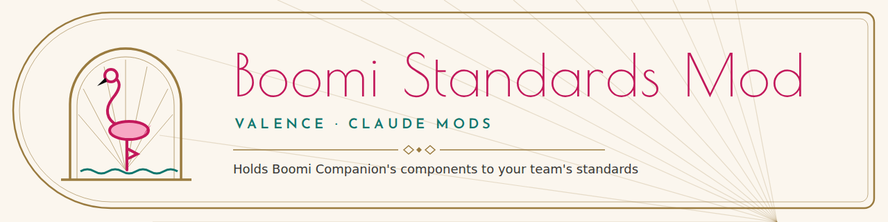
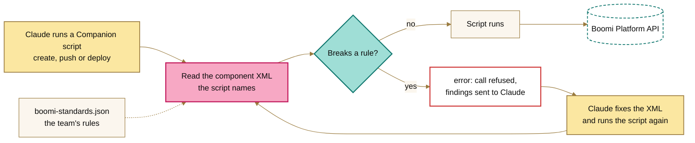

<picture>
  <source media="(prefers-color-scheme: dark)" srcset="assets/banner-night.png">
  
</picture>

# Boomi Standards Mod

A Claude Code mod that holds [Boomi Companion](https://github.com/OfficialBoomi/bc-integration)'s components to your team's standards. Before Companion creates, pushes or deploys a component, the mod reads the component XML and refuses the call if the component breaks a rule, listing what's wrong. Claude fixes the component and tries again, so nothing that breaks the standards reaches the platform.

> **Prototype.** Built and tested against Companion's scripts and XML format. Not yet run against a live Boomi account. Works anywhere Companion does, including Claude Code on the web.

## What it does



Companion keeps every component as an XML file under `active-development/<type>/` and sends it to the platform with three scripts. The mod watches for those scripts in Claude's shell commands:

| Companion script | What the mod checks |
|---|---|
| `boomi-component-create.sh <file>` | The new component, including that its `componentId` is empty and its `folderId` is real |
| `boomi-component-push.sh <file>` | The updated component |
| `boomi-deploy.sh <file>` | The process being deployed |

Other commands, including Companion's other scripts, run as usual.

## The rules

| Rule | Default | Checks |
|---|---|---|
| `component-id-on-create` | error | A new component's `componentId` is empty; the platform assigns it. |
| `folder-missing` | error | The `folderId` is set and isn't a `{placeholder}`, so nothing lands in the account root. |
| `folder-not-allowed` | error | The `folderId` is one of the standards' `folders`, when it lists any. |
| `name-placeholder` | error | The name is set and has no `{placeholder}` left in it. |
| `name-pattern` | error | The name matches the standards' pattern for its component type. |
| `password-in-xml` | error | No password is typed into a `type="password"` field. Set passwords in the Boomi GUI instead. |
| `password-token` | error | No pulled password token is pushed back. A pull returns a 128-character token in place of the password, and pushing it replaces the real password with the token. Companion refuses this only for REST Client connections; the mod refuses it for every component. |
| `password-property-default` | error | Password process properties have no default value, which the API returns as plain text. Use Environment Extensions. |
| `secret-pattern` | error | No private keys, AWS keys, GitHub or Slack tokens, bearer or Basic auth credentials, or credentials in URLs anywhere in the XML. |
| `forbidden-text` | error | None of the standards' `forbiddenText` patterns, such as production hostnames. |
| `try-catch` | off | Every process has a Try/Catch step. |

Errors block the script. Warnings let it run and are passed to Claude with its output. Findings name the field and line, never the secret itself.

## Your team's standards

Put a `boomi-standards.json` in the session's working directory, next to Companion's `.env`, and check it in so the whole team shares it. Without one, the default rules above apply. [`boomi-standards.example.json`](boomi-standards.example.json) is a starting point:

```json
{
  "naming": {
    "process": "^[A-Z]{2,5}_[A-Za-z0-9 ]+$",
    "connector-settings": "^CON_",
    "connector-action": "^OP_",
    "*": "^[A-Za-z0-9_ .-]+$"
  },
  "folders": [],
  "forbiddenText": [
    { "pattern": "prod\\.example\\.com", "message": "points at the production host; use an environment extension" }
  ],
  "severity": {
    "try-catch": "warning"
  }
}
```

- **`naming`**: a regular expression per component type, using the XML's `type=` value (`process`, `connector-settings` for connections, `connector-action` for operations, `transform.map`, `profile.json` and so on). `*` covers any type without its own pattern.
- **`folders`**: the folder IDs components may go in. Empty allows any folder.
- **`forbiddenText`**: regular expressions no component may contain, each with the message Claude sees.
- **`severity`**: `error`, `warning` or `off` for any rule.

A file with a mistake in it, such as an invalid pattern or an unknown rule, doesn't turn rules off: the mod falls back to the defaults and says why.

## Commands and tools

| Command | Tool Claude calls | Does |
|---|---|---|
| `/standards check [file...]` | `check` | Checks the files, or every component under `active-development/`. |
| `/standards rules` | | The rules in force and where they come from. |

The tool is listed to Claude as `mcp__boomi-standards__check`, so Claude can check components before it tries to push them. A status line shows the last result with an icon and a label: ✓ pass, ⚠ warnings, ✗ errors.

## Setup

Load it beside the [boomi-runtime](../boomi-runtime/README.md) mod, or on its own with Companion:

- **Claude Code on the web:** add the folder to the environment's `CLAUDE_CODE_PLUGIN_DIRS`, separating mods with `:`, for example `CLAUDE_CODE_PLUGIN_DIRS=/home/user/ClaudeMods/boomi-runtime:/home/user/ClaudeMods/boomi-standards`.
- **Terminal:** `claude --plugin-dir boomi-standards`.

It needs no credentials and no network access: it only reads files in the workspace.

## Settings

Set these under `/config`, or in settings under `pluginConfigs["boomi-standards"].options`:

| Setting | Default | |
|---|---|---|
| `enforce` | `true` | Refuse a create, push or deploy while a component has an error. Off, findings are only reported to Claude. |
| `rulesFile` | `boomi-standards.json` | The team's standards, relative to the session's working directory. |
| `componentsDir` | `active-development` | Where Companion keeps component XML; `/standards check` with no files checks everything under it. |

## Limits

- A deploy checks the process file the command names, not the components it references. Those were checked when Companion created or pushed them.
- The mod recognizes Companion's scripts by name in Bash commands. A component sent to the platform another way, such as `curl` straight to the Platform API, isn't checked.
- Checks read the XML as text, which fits the flat attributes these rules look at. Secret detection looks for known shapes and can miss a secret that has none.

## How it works

| Capability | Engine call | What it does in this mod |
|---|---|---|
| Tool-call hook | `tool.call` on `Bash` | Spots Companion's create, push and deploy scripts, checks their files, and refuses the call or passes it on. |
| Files | `$.fs` | Reads the component XML and `boomi-standards.json`. |
| Slash command | `$.command.register` | `/standards check` and `/standards rules`. |
| Tool for Claude | `$.tool.register` | `check`, so Claude can check components before pushing them. |
| Display | `$.ui.status` | The last result, with an icon and a label. |

## Development

Built against Claude Code 2.1.287.

```bash
cd boomi-standards
claude plugin validate .
claude plugin test .
```

The rules, the standards file and the reading of Companion commands (`hooks/rules.ts`) are plain functions with unit tests. Everything that touches the engine is in `hooks/register.ts`, because the engine only follows `$` within one file.
