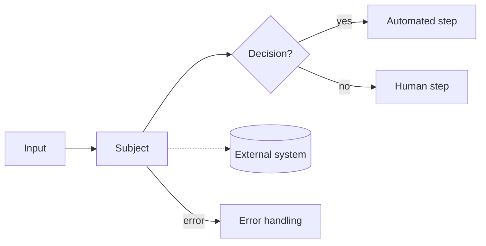

# Style

The colors, type and components used across these docs, connector READMEs and diagrams.

## Colors

### Day

<div data-swatches="day"></div>

### Night

<div data-swatches="night"></div>

### Status

Status always appears with an icon and a label, never as color alone.

<div data-status></div>

## Type

<div class="type-specimen">
  <div class="type-row"><span class="type-label">Display</span><span class="valence-wordmark" style="font-size:56px">Mods</span><span class="type-meta">Poiret One</span></div>
  <div class="type-row"><span class="type-label">Heading</span><span style="font-family:var(--valence-font-heading);font-size:28px;font-weight:600">Review Document</span><span class="type-meta">Josefin Sans 600</span></div>
  <div class="type-row"><span class="type-label">Label</span><span style="font-family:var(--valence-font-heading);font-size:14px;font-weight:600;letter-spacing:.2em;text-transform:uppercase">Connection fields</span><span class="type-meta">Josefin Sans 600, uppercase</span></div>
  <div class="type-row"><span class="type-label">Body</span><span style="font-size:16px">Every input document produces exactly one result.</span><span class="type-meta">System UI sans</span></div>
  <div class="type-row"><span class="type-label">Code</span><code>results/department/value</code><span class="type-meta">System monospace</span></div>
</div>

## Diagrams

Diagrams use five node styles: the subject, decisions, human steps, external systems and error paths.



## Components

<div class="downloads">
  <a class="button" href="#components">Primary action</a>
  <a class="button secondary" href="#components">Secondary action</a>
</div>

> Callout text sits on a soft highlight.

| Table header | Value |
|---|---|
| Row | `inline code` |
| Row | [Link](#components) |

```json
{ "status": "DECIDED", "results": { "department": { "value": "billing" } } }
```
